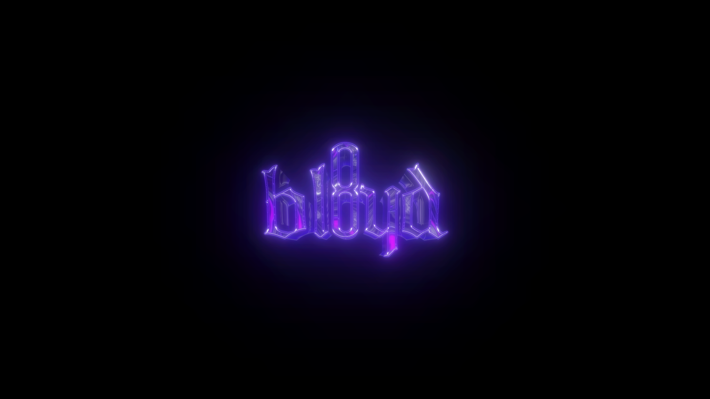

<!DOCTYPE html>
<html lang="en">
<head>

  <meta charset="UTF-8" />
  <title>bl8yd</title>
  <meta name="viewport" content="width=device-width, initial-scale=1.0" />
  
</head>
<body>
  <!-- Intro cursor particles -->
  <canvas id="introCanvas"></canvas>

  <!-- Logo Container -->
  

    
  

  <!-- Game menu -->
  

    <h1>bl8yd</h1>
    
Pick a game. Press <strong>F1</strong> anytime to return.

    <button class="menu-btn" onclick="startGame('codz')">COD Zombies</button>
    <button class="menu-btn" onclick="startGame('geodash')">Geometry Dash</button>
    <button class="menu-btn secondary" onclick="closeMenu()">Back to Intro</button>
  

  <!-- COD Zombies Container -->
  

    

      
COD Zombies

      

        <button class="game-btn back-btn" onclick="closeGame('codz')">← Back</button>
        <button class="game-btn" onclick="toggleFullscreen('codz')">Fullscreen</button>
      

    

    

      <iframe id="codz-frame" class="game-frame"></iframe>
    

  

  <!-- Geometry Dash Container -->
  

    

      
Geometry Dash

      

        <button class="game-btn back-btn" onclick="closeGame('geodash')">← Back</button>
        <button class="game-btn" onclick="toggleFullscreen('geodash')">Fullscreen</button>
      

    

    

      <iframe id="geodash-frame" class="game-frame"></iframe>
    

  

</body>
</html>
